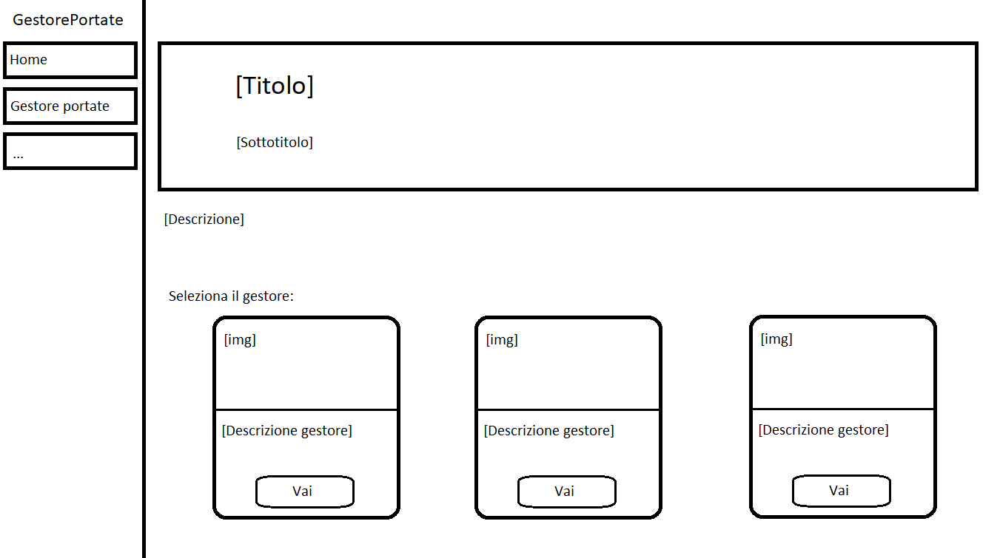
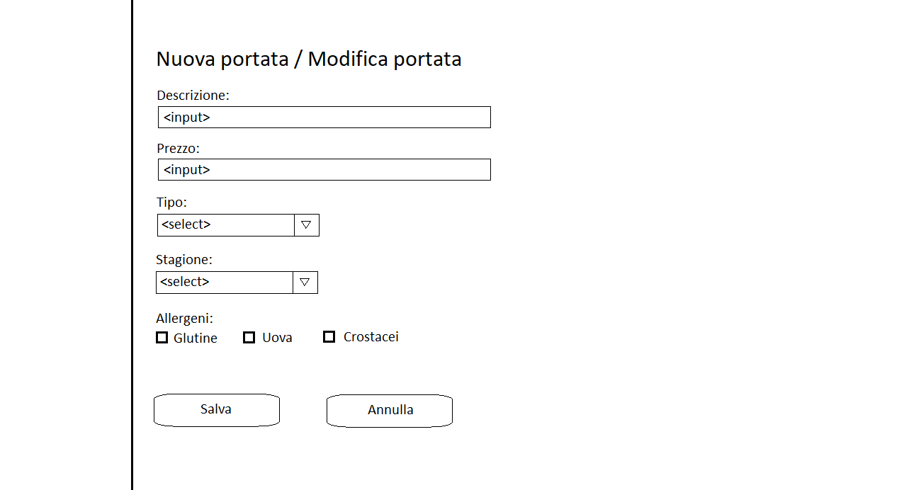

# Esame

Questo repo contiene il codice sorgente del progetto svolto per l'esame.


## Descrizione progetto

Il progetto prevede la realizzazione di una single page application che implementi un CRUD per la gestione delle portate e la conservazione degli stessi in un database. 


## Struttura progetto

Di seguito è illustrata la suddivisione in cartelle e la struttura del progetto.

```
Esame
|
|-- Data/  # Contiene classi e strutture dati, nonché il database
|   |
|   |-- Portata.cs  # rappresenta la struttura dati di una Portata
|   |-- Allergene.cs  # rappresenta la struttura dati di un Allergene
|   |-- Stagione.cs  # rappresenta la struttura dati di una Stagione
|   |-- Tipo.cs  # rappresenta la struttura dati di un Tipo
|   |-- PortataAllergene.cs  # rappresenta la struttura dati di un oggetto PortataAllergene
|   |-- DbPortate.cs  # rappresenta il DbContext e quindi la connessione al database
|   |-- portate.db  # è il database delle portate
|
|
|-- Components/  # Contiene i componenti riutilizzabili delle pagine
|   |
|   |-- PortateTable.razor  # è il componente che contiene la tabella che descrive gli oggetti Portata presenti in un database
|   |-- PortataForm.razor  # è il componente che contiene il form per la creazione e modifica di nuovi oggetti Portata
|   |-- Card.razor  # rappresenta una card, utilizzata in Index.razor
|
|
|-- Pages/  # Contiene gli end points del progetto
|   |
|   |-- Index.razor  # descrive la pagina home, dalla quale è possibile accedere al gestore delle portate
|   |-- GestorePortate.razor  # descrive la pagina di gestione delle portate

```


## Wireframe e user journey

La home dell'applicazione permette l'accesso al gestore delle portate ed eventualmente ad altre pagine dell'applicazione (_Img1_).  
La pagina di gestione delle portate permette la visualizzazione di una tabella collegata al database (_Img2_), con pulsanti che permettono operazioni di crud e l'accesso ad un form per modificare i dettagli della portata (_Img3_).

<details>
  <summary><strong>Img1</strong> - Homepage</summary>
  <br />
  <a href="Docs/home.png"></a>
  <br />
</details>


<details>
  <summary><strong>Img2</strong> - View</summary>
  <br />
  <a href="Docs/view.png"></a>
  <br />
</details>


<details>
  <summary><strong>Img3</strong> - Form</summary>
  <br />
  <a href="Docs/form.png"></a>
  <br />
</details>

